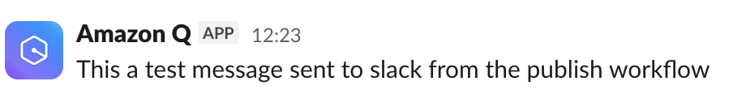
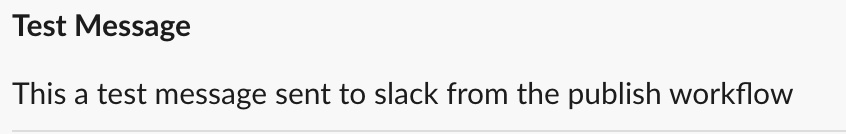
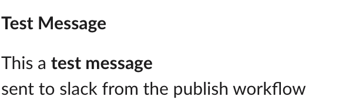

# Slack Notifications

This action posts messages to a Slack channel from workflows.
For example, if a release is created a message can be sent to Slack notifying a teams

## Usage

This action requires an SNS topic arn, which can be obtained from a stack created using the `build-notifications` template. This will post a message to the a Slack channel associated with the arn via Amazon Q Developer in chat applications.

Setting up Build notifications and Chatbots and how they work is beyond the scope of this action. Documentation can be found [here](https://govukverify.atlassian.net/wiki/spaces/PLAT/pages/3377168419/Slack+build+notifications+-+via+AWS+Chatbot)

A SNS Topic arn and message description is the only information required to be able to post a message to a Slack channel.

### Parameters

- `sns-topic-arn`: Required. The SNS Topic ARN to publish the notification to. This can be obtained as an output from the relevant `build-notification` stack
- `message-description`: Required. The description or body of the message to send
- `message-title`: Optional title of the message

## Using actions from this repo in other repos

Use the following syntax in your workflow:

`uses: govuk-one-login/github-actions/slack/send-slack-notification@{ref}`

The `ref` can be a specific branch, git ref or commit SHA.

### Examples:

#### Sample Message

```yaml
jobs:
  job:
    steps:
      - name: Step
        uses: govuk-one-login/github-actions/slack/send-slack-notification@main
        with:
          sns-topic-arn: arn:aws:sns:eu-west-2:999999999999:my-build-notification-topic
          message-description: This a test message sent to slack from the publish workflow
```

## 

#### Message with Title

```yaml
jobs:
  job:
    steps:
      - name: Step
        uses: govuk-one-login/github-actions/slack/send-slack-notification@main
        with:
          sns-topic-arn: arn:aws:sns:eu-west-2:999999999999:my-build-notification-topic
          message-description: "This a test message sent to slack from the publish workflow"
          message-title: "Test Message"
```

## 

#### Message with Formatting and Multi-lines

```yaml
jobs:
  job:
    steps:
      - name: Step
        uses: govuk-one-login/github-actions/slack/send-slack-notification@main
        with:
          sns-topic-arn: arn:aws:sns:eu-west-2:999999999999:my-build-notification-topic
          message-description: "This a *test message*\\n sent to slack from the publish workflow"
          message-title: "Test Message"
```

## 
