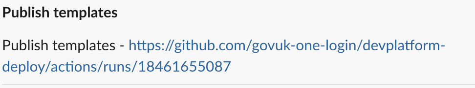

# Slack Notifications

This action posts messages to a Slack channel from workflows.
For example, if a workflow fails a message can be sent to Slack notifying a team of the failure so they can investigate the root cause

## Usage

This action requires an SNS topic arn, which can be obtained from a stack created using the `build-notifications` template. This will post a message to the a Slack channel associated with the arn via Amazon Q Developer in chat applications.

Setting up Build notifications and Chatbots and how they work is beyond the scope of this action. Documentation can be found [here](https://govukverify.atlassian.net/wiki/spaces/PLAT/pages/3377168419/Slack+build+notifications+-+via+AWS+Chatbot)

A SNS Topic arn is the only information required to be able to post a message to a Slack channel. In this case, a default message is created

### Parameters

- `sns-topic-arn`: Required. The SNS Topic ARN to publish the notification to. This can be obtained as an output from the relevant `build-notification` stack
- `message-title`: The title of the message to send. If omitted, this defaults to the name of the workflow
- `message-description`: The description or body of the message to send. If omitted, this defaults to the name of the workflow and a link to the workflow run
- `status`: Optional status to include in the default message description (e.g., 'Succeeded', 'Failed'). If included, it is inserted into the message description, so the message becomes the name of the workflow, the status and a link to the workflow run. This only applies to the default message. If a custom message is provided in `message-description` the `status` is ignored, though status information can be included in that custom message
- `status-icon`: Optional icon to include with the status in the default message title (e.g., '✅'). If included, it is prepended to the message title, so the title becomes the icon and the name of the workflow. If status icon is not provided, but a status of 'failed' (case insensitive) is provided, the status icon defaults to ❌. If status icon is not provided, but a status of 'succeeded' (case insensitive) is provided, the status icon defaults to ✅

## Using actions from this repo in other repos

Use the following syntax in your workflow:

`uses: govuk-one-login/github-actions/slack/send-slack-notification@{ref}`

The `ref` can be a specific branch, git ref or commit SHA.

### Examples:

#### Default Message

```yaml
jobs:
  job:
    steps:
      - name: Step
        uses: govuk-one-login/github-actions/slack/send-workflow-slack-notification@main
        with:
          sns-topic-arn: arn:aws:sns:eu-west-2:999999999999:my-build-notification-topic
```

## 

#### Default Message with Status

```yaml
jobs:
  job:
    steps:
      - name: Step
        uses: govuk-one-login/github-actions/slack/send-workflow-slack-notification@main
        with:
          sns-topic-arn: arn:aws:sns:eu-west-2:999999999999:my-build-notification-topic
          status: "Failed"
```

## 

#### Default Message with Status and Icon

```yaml
jobs:
  job:
    steps:
      - name: Step
        uses: govuk-one-login/github-actions/slack/send-workflow-slack-notification@main
        with:
          sns-topic-arn: arn:aws:sns:eu-west-2:999999999999:my-build-notification-topic
          status: "Failed"
          status-icon: "⛔"
```

## 

#### Custom Message Title

```yaml
jobs:
  job:
    steps:
      - name: Step
        uses: govuk-one-login/github-actions/slack/send-workflow-slack-notification@main
        with:
          sns-topic-arn: arn:aws:sns:eu-west-2:999999999999:my-build-notification-topic
          message-title: "Custom Message Title"
```

## 

#### Custom Message Title and Description

```yaml
jobs:
  job:
    steps:
      - name: Step
        uses: govuk-one-login/github-actions/slack/send-workflow-slack-notification@main
        with:
          sns-topic-arn: arn:aws:sns:eu-west-2:999999999999:my-build-notification-topic
          message-title: "Custom Message Title"
          message-description: "Custom message being sent to Slack from the workflow"
```

## 

#### Custom Message Title with Icon and Description

```yaml
jobs:
  job:
    steps:
      - name: Step
        uses: govuk-one-login/github-actions/slack/send-workflow-slack-notification@main
        with:
          sns-topic-arn: arn:aws:sns:eu-west-2:999999999999:my-build-notification-topic
          message-title: "Custom Title"
          message-description: "Custom message being sent to Slack from the workflow"
          status-icon: "⛔"
```


#### Custom Message with Formatting and Multi-lines

```yaml
jobs:
  job:
    steps:
      - name: Step
        uses: govuk-one-login/github-actions/slack/send-slack-notification@main
        with:
          sns-topic-arn: arn:aws:sns:eu-west-2:999999999999:my-build-notification-topic
          message-title: "⛔ Custom Title"
          message-description: "Custom message *being sent to Slack*\\n from the workflow"
```

## 
